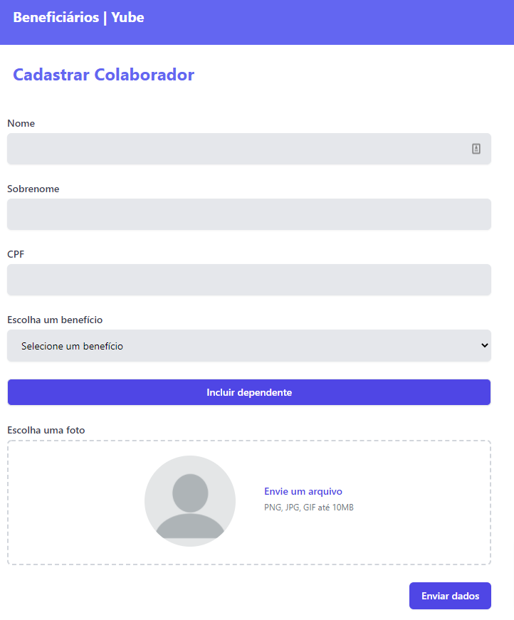

<p align="center">
  
</p>

<p align="center">
  <a href="#-technologies">Technologies</a>&nbsp;&nbsp;&nbsp;|&nbsp;&nbsp;&nbsp;
  <a href="#-getting-started">Getting started</a>&nbsp;&nbsp;&nbsp;|&nbsp;&nbsp;&nbsp;
  <a href="#-project">Project</a>&nbsp;&nbsp;&nbsp;|&nbsp;&nbsp;&nbsp;
  <a href="#-layout">Layout</a>&nbsp;&nbsp;&nbsp;|&nbsp;&nbsp;&nbsp;
  <a href="#-next-steps">Next steps</a>

<br>

<h1 align="center">
    <a href="https://beneficiarios-yube.netlify.app" target="_blank">
      
    </a>
</h1>

---

## 🧪 Technologies

This project was developed using the following technologies:

- [React](https://reactjs.org)
- [Firebases](https://firebase.google.com/)
- [Tailwind](https://tailwindcss.com/)
- [Styled Components](https://styled-components.com/)

## 🚀 Getting started

Clone the project and access the folder

```bash
$ git clone https://github.com/eltonsantos/beneficiarios-yube.git && cd beneficiarios-yube
```

Follow the steps below
```bash
# Install the dependencies
$ yarn

# Start the project
$ yarn start

```

## 💻 Project

This project was developed for testing in the company **[Yube](https://yube.com.br/)** to be Fullstack, **in May 31, 2021**. For the first version, unfortunately many features are not available yet. 🥺

To access the project **[Beneficiarios-Yube](https://beneficiarios-yube.netlify.app)** enter with email: **admin@yube.com** and password: **123**

## 🔖 Layout

The layout was created from scratch using the **TailWindCSS** framework.

## 🐾 Next steps

###### Escreverei essa parte em português

- [ ] Implementar função de adicionar dependentes 👶
- [ ] Implementar função de mudar o parecer 📃
- [ ] Modo dark mode para os olhos agradecerem 😎
- [ ] Ajustar alguns detalhes para o Layout ficar bem resposivo e fofo 🥰
- [ ] Permitir que os dados dos colaboradores possam ser editados ✏
- [ ] Validar os campos para evitar fazerem besteira 🐱‍💻
- [ ] Construir filtro para mostrar os colaboradores que possuem um ou mais dependentes 👨‍👨‍👦‍👦
- [ ] Criar uma busca por nome e cpf 🔎
- [ ] E muito mais... ❤💪🏼

---

## 👨🏻‍💻 Author

<h3 align="center">
  
  <br/>
  <strong>Elton Santos</strong> 🚀
  <br/>
  <br/>

 <a href="https://www.linkedin.com/in/eltonmelosantos" alt="LinkedIn" target="blank">
    
  </a>

  <a href="mailto:elton.melo.santos@gmail.com?subject=Olá%20Elton" alt="Email" target="blank">
    
  </a>

<br/>

Made with ❤️ by Elton Santos 👋🏽 [Entre em contato!](https://www.linkedin.com/in/eltonmelosantos/)

</h3>